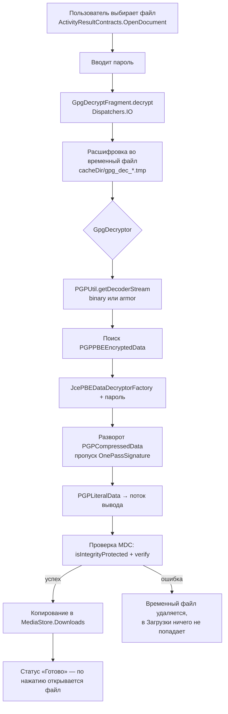

# App_Blackview

Android-приложение «всё в одном» для первичной настройки и обслуживания телефона Blackview (и подобных устройств) **без root**: установка наборов APK, настройка системы через Shizuku, клонирование Git-репозиториев, встроенный терминал и расшифровка файлов.

Ветка `refactor-chatgp/gpg-decryptor` — рефакторинг вкладки **GPG Decryptor**: выделенный класс `GpgDecryptor` на Bouncy Castle, расшифровка паролем (`gpg --symmetric`) через системный выбор файла, безопасная запись результата в «Загрузки».

> Интерфейс приложения — на русском языке.

---

## Содержание

- [Возможности](#возможности)
- [GPG Decryptor: как это работает](#gpg-decryptor-как-это-работает)
- [Вкладки приложения](#вкладки-приложения)
- [Архитектура и структура проекта](#архитектура-и-структура-проекта)
- [Работа без root: Shizuku и Accessibility](#работа-без-root-shizuku-и-accessibility)
- [Разрешения](#разрешения)
- [Требования и сборка](#требования-и-сборка)
- [Использование GPG Decryptor](#использование-gpg-decryptor)
- [Безопасность и известные ограничения](#безопасность-и-известные-ограничения)
- [Стек](#стек)

---

## Возможности

| Область | Что делает |
|---|---|
| **GPG Decryptor** | Расшифровывает файлы, зашифрованные паролем (`gpg --symmetric`), бинарные и ASCII-armored |
| **OpenSSL Decryptor** | Расшифровывает файлы и base64-строки формата `openssl enc -aes-256-cbc -pbkdf2` |
| **Установка APK** | Скачивает APK с GitHub Releases и ставит их; пакетная установка из `Download/download-APK` и `/sdcard/apk` |
| **Shizuku** | Ставит вшитый Shizuku, автоматизирует сопряжение, выполняет команды уровня `adb shell` на самом устройстве |
| **Настройка устройства** | Применяет набор системных настроек, блокирует фон/уведомления/геолокацию у выбранных приложений |
| **Git Clone** | Клонирует репозитории через JGit (без git-бинарника и Shizuku) |
| **Терминал** | Простой shell-терминал с командами `shell …` и `adb …` |
| **Служебное** | Сохраняет списки установленных пакетов, показывает дату сборки, ветку и коммит |

---

## GPG Decryptor: как это работает

### Что поддерживается

- симметричное шифрование паролем: `gpg --symmetric`, `gpg -c`;
- бинарные `.gpg` и ASCII-armored (`.asc`) файлы;
- сжатые данные (в том числе вложенное сжатие);
- проверка целостности MDC (Modification Detection Code);
- зашифрованные и подписанные сообщения — подпись **пропускается**, извлекается только содержимое.

### Что не поддерживается

- файлы, зашифрованные **публичным ключом** — приложение сообщит, что файл зашифрован не паролем;
- проверка цифровых подписей (осознанно, см. комментарий в `GpgDecryptor`);
- расшифровка с секретным ключом / связкой ключей.

### Поток данных



### Ключевые решения в коде

**`crypto/GpgDecryptor.kt`** — ядро расшифровки.

- `decrypt(InputStream, OutputStream, CharArray)` — основной метод; вызывающий владеет потоками и закрывает их.
- `decrypt(File, File, CharArray)` — файловая обёртка.
- `decryptGpgSymmetric(...)` — совместимые обёртки для существующих вызовов (поток + `CharArray` либо пути + `String`, возвращает `Boolean`).
- `findEncryptedData` — пропускает пакеты до `PGPEncryptedDataList` и выбирает именно `PGPPBEEncryptedData`; если есть только записи для публичного ключа, бросает понятную ошибку.
- `findLiteralData` — спускается по структуре сообщения: `Compressed → OnePassSignatureList → Literal`.
- **Провайдер:** вместо `setProvider("BC")` передаётся экземпляр `BouncyCastleProvider()`. В Android уже зарегистрирован встроенный провайдер с именем `BC`, и обращение по имени приводит к ошибкам вроде `No such algorithm SHA-256 for provider BC`.
- Проверка целостности выполняется **после** чтения всего открытого текста — поэтому вызывающий код обязан писать результат во временное место (так и делает фрагмент).

**`fragments/GpgDecryptFragment.kt`** — UI и безопасная запись.

- Пароль берётся как есть (без `trim`) и хранится в `CharArray`, который обнуляется в `finally`.
- Расшифровка идёт во временный файл в `cacheDir`; в «Загрузки» файл копируется только при успехе — неверный пароль не оставит пустой/битый файл.
- Запись в «Загрузки» — через `MediaStore.Downloads` (разрешение на запись не нужно), при ошибке запись откатывается.
- Имя результата: `name.gpg` / `.pgp` / `.asc` → `name`; иначе `name.dec`.
- Сообщения об ошибках: `PGPDataValidationException` → «Неверный пароль», текст с `checksum` / `exception decrypting` → «Неверный пароль или повреждённый файл».

---

## Вкладки приложения

Навигация — столбец кнопок слева, содержимое — `Fragment` справа (`MainActivity`).

| # | Кнопка | Фрагмент | Назначение |
|---|---|---|---|
| 1 | Первая | `FirstFragment` | Скачивание и установка APK по кнопкам (ссылки на GitHub Releases): файловые менеджеры, мессенджеры, плееры, VPN, терминалы, банковские приложения и др. |
| 2 | Вторая | `SecondFragment` | Установка всех APK из `/sdcard/apk`, удаление пакетов по списку и GMS, скачивание/распаковка `main.tar.gz`, последовательная загрузка набора APK, установка обоев |
| 3 | Третья | `ThirdFragment` | Скачивание и расшифровка `definitly.gnucash.gpg` (через `GpgDecryptor`), загрузка заметок, клонирование DCIM, перезагрузка и выключение через Shizuku, самоудаление |
| 4 | Git Clone | `SixthFragment` | Клонирование любого репозитория по URL в `Download/<имя-репозитория>` (JGit) |
| 5 | Седьмая | `SeventhFragment` | Загрузка и установка Gate (из zip), загрузка Binance |
| 6 | OpenSSL Decryptor | `NinthFragment` | Расшифровка файлов и base64-сообщений формата OpenSSL |
| 7 | **GPG Decryptor** | `GpgDecryptFragment` | Расшифровка GPG-файлов паролем |
| 8 | Десятая | `TenthFragment` | Информация о сборке: дата, версия, ветка Git, короткий хэш коммита |
| 9 | Terminal | `TerminalFragment` | Терминал |
| 10 | Настройка | `SetupFragment` | Shizuku, автосопряжение, разблокировка меню разработчика, USB-отладка, применение настроек, блокировка разрешений, Wi-Fi |

### OpenSSL Decryptor

Ожидает формат `openssl enc -aes-256-cbc -pbkdf2 -salt`: заголовок `Salted__`, 8 байт соли, затем шифртекст. Ключ и IV (48 байт) выводятся через PBKDF2-HMAC-SHA256, шифр — `AES/CBC/PKCS5Padding`.

Число итераций PBKDF2 **в коде разное**: для файлов — `100000`, для base64-сообщений — `1000000`. Шифруйте с совпадающим `-iter`:

```sh
openssl enc -aes-256-cbc -pbkdf2 -iter 100000  -salt -in file -out file.enc      # для файлов
openssl enc -aes-256-cbc -pbkdf2 -iter 1000000 -salt -a -in msg.txt -out msg.enc # для строк
```

### Терминал

- встроенные команды: `help`, `clear`, `echo`;
- прямые shell-команды без префикса: `uname`, `whoami`, `id`, `pwd`, `ls`, `date`, `uptime`, `df`, `du`, `free`, `ps`, `env`, `printenv`, `getprop`, `mount`, `which`, `cat`, `head`, `tail`;
- `shell <команда>` — выполняет `sh -c` от имени приложения (рабочая папка — `files/Download`);
- `adb <команда>` — выполняет от имени shell-пользователя через Shizuku.

### Вкладка «Настройка»

Команды выполняются через Shizuku (`DeviceSetup`, `BlockPermissions`): режим энергосбережения, отключение сервисов Google Play, беззвучный режим, часовой пояс, клавиатура OpenBoard, поведение кнопки питания; затем для списка пакетов — запрет фоновой работы, уведомлений и геолокации (`cmd appops`, `pm revoke`). Каждый шаг пишется в лог на экране.

---

## Архитектура и структура проекта

Один Gradle-модуль `:app`, пакет `com.example.app`, одна `Activity` + фрагменты (View Binding включён).

```
app/src/main/
├── aidl/com/example/app/shell/IShellService.aidl   # IPC-интерфейс shell-сервиса Shizuku
├── assets/shizuku-v13.6.0.r1086.*.apk              # вшитый Shizuku
├── java/
│   ├── DownloadHelper.kt                           # старый загрузчик (пакет по умолчанию)
│   └── com/example/app/
│       ├── MainActivity.kt                         # навигация, edge-to-edge, сохранение списков пакетов
│       ├── ApkAutoInstaller.kt                     # пакетная установка из Download/download-APK
│       ├── PackageSaver.kt                         # packages.txt и GMSpackages
│       ├── crypto/GpgDecryptor.kt                  # ★ расшифровка GPG (Bouncy Castle)
│       ├── fragments/                              # экраны (см. таблицу вкладок)
│       │   └── GPGHelper.kt, GitClone.kt, DownloadHelper2.kt   # старые/вспомогательные классы
│       ├── download/DownloadHelper.kt              # централизованный загрузчик (DownloadManager)
│       ├── git/GitRepositoryCloner.kt              # клонирование через JGit
│       ├── pairing/                                # автоматизация через Accessibility
│       ├── shell/                                  # Shizuku, установщики, настройка устройства
│       └── terminal/                               # CommandRegistry, TerminalController
├── res/                                            # layout, строки, иконки приложений
└── test/.../CommandRegistryTest.kt                 # unit-тест реестра команд
```

### Модули

| Модуль | Роль |
|---|---|
| `shell/AdbShell` | Singleton: проверка Shizuku, запрос разрешения, привязка `IShellService`, выполнение команд с таймаутом |
| `shell/ShellService` | Процесс, который Shizuku запускает с правами shell (uid 2000): `sh -c`, возвращает `код\nвывод` |
| `shell/ShizukuInstaller` | Копирует Shizuku из assets и запускает системный установщик; удаление через `ACTION_DELETE` |
| `shell/SdcardApkInstaller` | Ищет папки `apk`/`APK` на внутренней памяти и SD/USB; с Shizuku — `pm install -r`, без — `PackageInstaller` |
| `shell/PackageSessionInstaller` | Установка через `PackageInstaller` по очереди, с подтверждением на каждый APK |
| `shell/SelfApkSaver` | Копирует APK самого приложения в `Download/download-APK` |
| `shell/WifiConnector` | Добавляет Wi-Fi через `WifiNetworkSuggestion` (без Shizuku) |
| `shell/DeviceSetup`, `BlockPermissions` | Списки команд для вкладки «Настройка» |
| `pairing/PairingAccessibilityService` | Служба доступности + `PairingAutomation` (запуск/остановка сценариев, лог) |
| `pairing/PairingScript` | Автосопряжение Shizuku по беспроводной отладке (читает код, вводит в уведомление, жмёт «Запустить» и «Разрешить всегда») |
| `pairing/DeveloperUnlockScript`, `DevOptionsUnlockScript` | 7 нажатий на «Номер сборки», включение меню разработчика |
| `pairing/UsbDebugScript` | Включение и выключение отладки по USB |
| `download/DownloadHelper` | Один `DownloadManager`-ресивер на все загрузки, публичная папка `Download/download-APK` |
| `git/GitRepositoryCloner` | Асинхронный `git clone` (JGit) с `Result<File>` |
| `terminal/*` | Разбор команд и выполнение без блокировки UI |

---

## Работа без root: Shizuku и Accessibility

1. **Установить Shizuku** — вкладка «Настройка» → кнопка установки (APK вшит в приложение).
2. **Включить меню разработчика** — кнопка «Разблокировать меню разработчика» (нужна служба доступности; PIN/пароль при запросе вводится вручную).
3. **Сопряжение** — кнопка автосопряжения: сценарий открывает «Беспроводную отладку», читает код и вводит его в Shizuku.
4. После запуска Shizuku приложение получает права уровня `adb shell`: тихая установка (`pm install -r`), `cmd appops`, `settings put`, перезагрузка и выключение.

Без Shizuku часть функций продолжает работать: установка через системный `PackageInstaller`, JGit-клонирование, обе вкладки расшифровки, Wi-Fi через `WifiNetworkSuggestion`.

> Службу доступности нужно один раз включить вручную в системных настройках. Сценарии ищут элементы по тексту (ru/en), поэтому на других прошивках и языках тексты могут потребовать правки.

---

## Разрешения

| Разрешение | Зачем |
|---|---|
| `INTERNET`, `ACCESS_NETWORK_STATE`, `ACCESS_WIFI_STATE`, `CHANGE_WIFI_STATE` | Загрузки, проверка сети, добавление Wi-Fi |
| `REQUEST_INSTALL_PACKAGES`, `REQUEST_DELETE_PACKAGES` | Установка и удаление APK |
| `MANAGE_EXTERNAL_STORAGE` | Чтение `/sdcard/apk` и запись в `Download` без Shizuku |
| `QUERY_ALL_PACKAGES` | Список пакетов, удаление пакетов |
| `WRITE_SETTINGS`, `SET_WALLPAPER` | Яркость, обои |
| `moe.shizuku.manager.permission.API_V23` | Доступ к API Shizuku |
| `BIND_ACCESSIBILITY_SERVICE` (служба) | Автоматизация настроек |

Для самой расшифровки GPG никаких специальных разрешений не нужно: файл выбирается через Storage Access Framework, результат пишется через `MediaStore`.

---

## Требования и сборка

- Android **15+** (`minSdk 35`, `targetSdk 35`, `compileSdk 36`)
- JDK 11+ (в проекте `sourceCompatibility = 11`), Gradle Wrapper, Android Gradle Plugin 8.12.3, Kotlin 2.0.21

```sh
git clone https://github.com/definitly486/App_Blackview.git
cd App_Blackview
git checkout refactor-chatgp/gpg-decryptor

# release-сборка (скрипт добавляет -Dos.name=Linux)
./build.sh

# либо напрямую
./gradlew assembleRelease
```

Готовый APK: `app/build/outputs/apk/release/app_Blackview_release_v<версия>_<дата>_<коммит>.apk`.

В `BuildConfig` при сборке записываются: время сборки, ветка Git, короткий и полный хэш коммита (их показывает вкладка «Десятая»).

Вспомогательные скрипты: `git.sh` — коммит и push, `release_apk.sh` — загрузка собранного APK в GitHub Release с тегом `apk` через `gh`.

Debug-сборка получает суффикс `.debug` у `applicationId`.

---

## Использование GPG Decryptor

1. Откройте вкладку **GPG Decryptor**.
2. Нажмите **«Выбрать .gpg файл»** и укажите файл.
3. Введите пароль.
4. Нажмите **«Расшифровать»**.
5. Результат появится в `Загрузки`; нажмите на строку статуса, чтобы открыть файл.

Подготовить файл на компьютере:

```sh
gpg --symmetric --cipher-algo AES256 secret.txt     # → secret.txt.gpg
gpg --symmetric --armor secret.txt                  # → secret.txt.asc
```

Проверить расшифровку вручную: `gpg --decrypt secret.txt.gpg`.

---

## Безопасность и известные ограничения

- **Подписи не проверяются.** `GpgDecryptor` только расшифровывает данные; подписанное сообщение будет расшифровано без проверки автора.
- **Целостность проверяется в конце потока.** Приложение пишет во временный файл и публикует результат только после успешной проверки; при прямом использовании `GpgDecryptor` с выходным потоком учитывайте это.
- **Пароль** хранится в `CharArray` и затирается после использования, но поле ввода Android всё равно создаёт `String` внутри `EditText`.
- **Распаковка архивов.** В `DownloadHelper2.decompressTarGz` проверка Zip Slip закомментирована — распаковывайте только доверенные архивы.
- **Права приложения очень широкие** (`MANAGE_EXTERNAL_STORAGE`, `QUERY_ALL_PACKAGES`, служба доступности, Shizuku). Приложение рассчитано на личное устройство владельца, а не на публикацию в магазинах.
- **Release-сборка подписана debug-ключом** (`signingConfig = debug`) — для распространения нужен собственный keystore.
- **Конфиденциальные данные в исходниках:** SSID и пароль Wi-Fi лежат в `shell/DeviceSetup.kt` и попадают в APK и историю Git. Рекомендуется вынести их в `local.properties` / `BuildConfig` или запрашивать у пользователя. Файл `local.properties` тоже лучше убрать из репозитория (в `.gitignore`).
- **Устаревший код:** `fragments/GPGHelper.kt`, `fragments/GitClone.kt`, `adapters/ViewPager2.kt` и корневой `DownloadHelper.kt` дублируют более новые реализации и могут быть удалены после проверки ссылок.

---

## Стек

| Назначение | Библиотека |
|---|---|
| Криптография OpenPGP | Bouncy Castle `bcprov` / `bcpg` / `bcpkix` (jdk18on) 1.82 |
| Git | Eclipse JGit 6.8 |
| Права shell без root | Shizuku API / Provider 13.1.5 |
| Архивы | Apache Commons Compress 1.28, XZ for Java |
| UI | Material Components, ConstraintLayout, ViewPager2, Fragment KTX |
| Асинхронность | Kotlin Coroutines, Lifecycle KTX |
